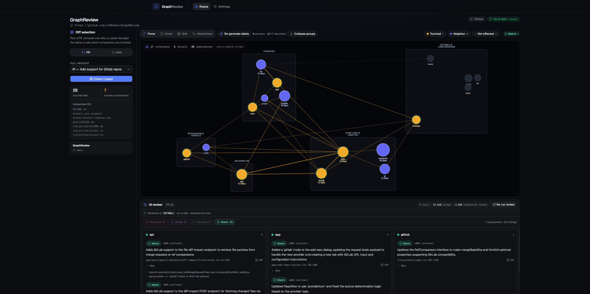

# GraphReview

A locally-run tool for reviewing GitHub pull requests and GitLab merge
requests against a codebase's component graph.




## Quickstart (Docker Compose — recommended)

```bash
cp docker/.env.example docker/.env
# edit docker/.env: set LOCAL_REPOS_PATH, NEO4J_PASSWORD, SESSION_SECRET

docker compose -f docker/docker-compose.yml --env-file docker/.env up
```

The app is served at [http://localhost:3470](http://localhost:3470) (set
`APP_PORT` in `docker/.env` to use another port). Neo4j
and Redis run as internal-only services (not published to the host).

## Local development (without Docker)

```bash
npm install
npm run dev       # Next.js dev server, http://localhost:3470 (other port: npm run dev -- -p 4000)
npm run worker    # BullMQ worker process (separate terminal)
```

You'll need your own Neo4j 5 and Redis instances reachable via the env vars
in `docker/.env.example` (`NEO4J_URI`, `NEO4J_USER`, `NEO4J_PASSWORD`,
`REDIS_URL`, `SESSION_SECRET`).

## Running your own AI

GraphReview's labeling and PR review features call an OpenAI-compatible
`/v1/chat/completions` endpoint, so a locally-run model (e.g. Ollama) works
as a drop-in replacement for a hosted API key. See
[`install.md`](install.md#6-optional-features) for setup steps.

## Project layout

Each `lib/*`, `worker/`, `types/`, and `components/graph/` directory has its
own `README.md` stating what belongs there.
