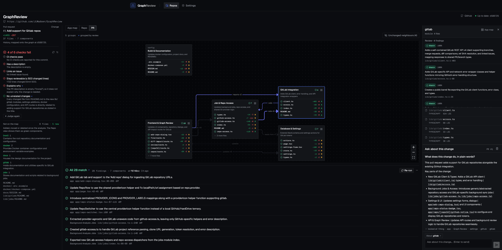
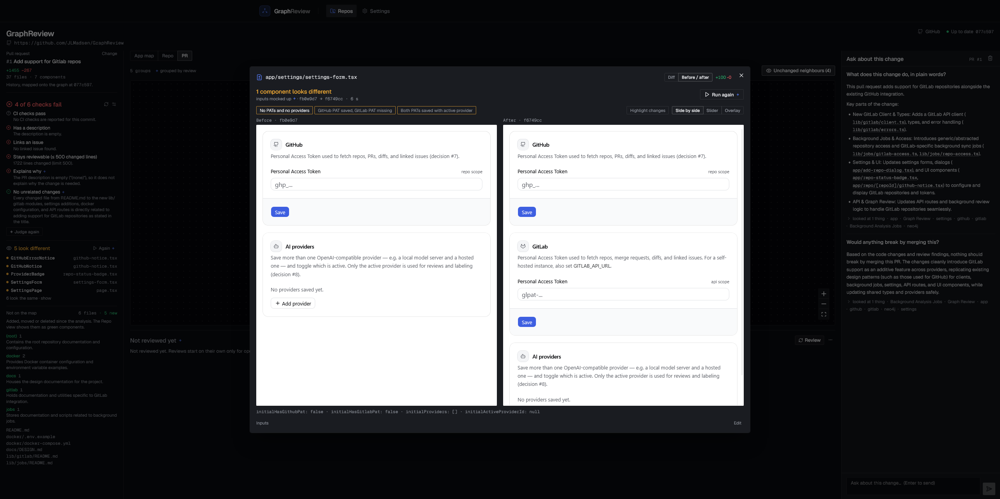
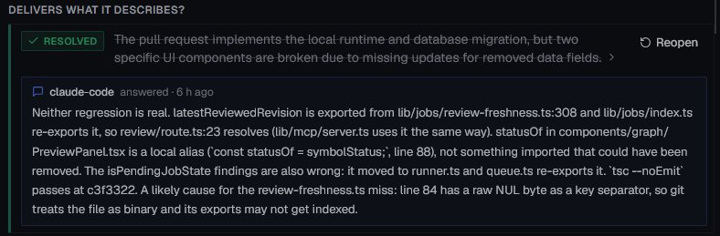

<p align="center">
  
</p>

<h1 align="center">GraphReview</h1>

<p align="center">
  Review the shape of a pull request, not just its diff.
</p>

<p align="center">
  <code>npx graphreview</code>
</p>

---

A 40-file pull request is a wall of diffs in alphabetical order. You read
`api/`, then `components/`, then `lib/`, and somewhere in the middle you're
supposed to work out how it all connects.

GraphReview draws the PR on a map of your codebase instead. Changed files are
grouped into components, the components are wired together by the imports and
calls between them, and you can see at a glance which parts of the app a
change actually touches and which ones depend on it.



It runs on your machine, against GitHub pull requests, GitLab merge requests
or plain branches in a local checkout. No account, no cloud, nothing to host.

> [!NOTE]
> Reviews are as good as the model you hook it up to.

## What it does

**Maps the change.** Static analysis builds a component graph of the repo
(JS/TS, Python, Go, Java, Kotlin, Rust), and every PR is laid out on it.
Unchanged neighbours are one click away when you want to know who calls the
thing that changed.

**Checks the basics.** Does the PR have a description, link an issue, stay
under a reviewable size, explain *why*? Small things, but they're the first
things a reviewer asks about.

**Reviews it with AI, if you want.** Each component gets its own review, and
every finding is graded (defect, concern, unknown, ok) so you can start with
what matters. There's a chat on the side for "what does this actually do?"
and "would merging this break anything?". Point it at any OpenAI-compatible
endpoint, including a model running on your own GPU. Without one, everything
else still works.

**Shows you the UI change.** For React and Next.js repos, GraphReview
renders changed components at the base and at the head, side by side, in a
throwaway Docker container. Swap the mocked props to see each state.



**Talks to your coding agent.** An MCP server lets Claude Code (or any other
agent) read the open findings, look at the code, and reply to each one:
"doesn't hold, because…" or "fair, fixing it". The replies show up right
under the finding.



## Getting started

You need [Node.js](https://nodejs.org) 22.13+ and [git](https://git-scm.com).

```bash
npx graphreview
```

That's it. It opens at [http://127.0.0.1:3470](http://127.0.0.1:3470) and
keeps everything (database, clones, the key for your saved tokens) in
`~/.graphreview`. Ctrl+C to stop.

Add a repo from the start page: pick a local checkout or paste a GitHub or
GitLab URL. For pull requests and private repos, drop a personal access token
into Settings. Local repos need no token at all.

Options: `--port <n>`, `--data <dir>`, `--no-open`.
[Docker](https://www.docker.com/products/docker-desktop/) is only needed for
the before/after previews.

[`docs/install.md`](docs/install.md) has the rest: configuration, where data lives,
known limits.

### Behind a corporate firewall?

GraphReview picks up your existing npm/pip config and the certificates your
machine already trusts. Self-hosted GitLab or GitHub Enterprise, registry
mirrors and extra CAs each take one line in `~/.graphreview/config.env`.
[Here's the full setup](docs/install.md#private-registries-company-certificates-and-offline-networks).

### Using a local model

Anything that speaks `/v1/chat/completions` works, so
[Ollama](https://ollama.com) is a drop-in replacement for a hosted API key.
Setup is in [`docs/install.md`](docs/install.md#6-optional-features). Be warned that a
7B model reviews like a 7B model.

### Connecting a coding agent

While GraphReview runs, it serves MCP at `http://127.0.0.1:3470/api/mcp`.
For Claude Code, add this `.mcp.json` to the root of the repo you're working in:

```json
{ "mcpServers": { "graphreview": { "type": "http", "url": "http://127.0.0.1:3470/api/mcp" } } }
```

Settings → Connect a coding agent covers other agents, and
[`lib/mcp/README.md`](lib/mcp/README.md) lists the tools.

## Development

```bash
npm install
npm run dev       # http://localhost:3470, workers included
```

It's one Node process: the Next.js server and the background workers share
it, and everything lives in a single SQLite file. `npm run dev` keeps its
data in `.data/`, away from an installed copy. Each `lib/*`, `worker/`,
`types/` and `components/graph/` folder has a `README.md` saying what
belongs there.
